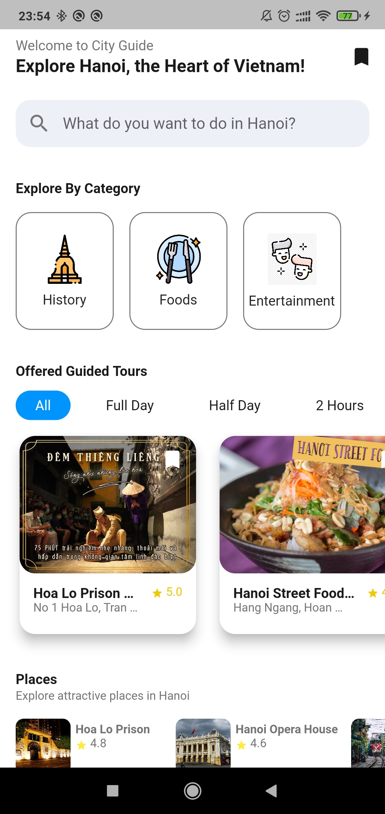
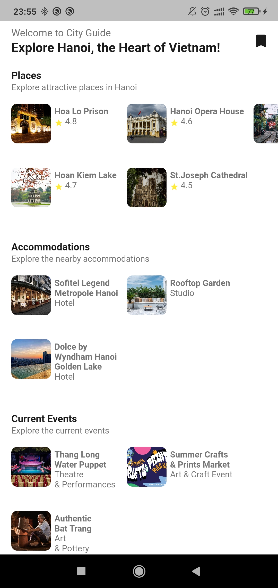
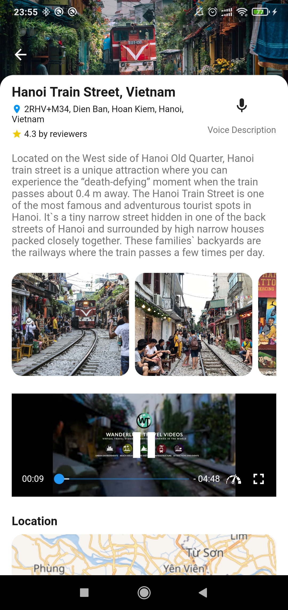
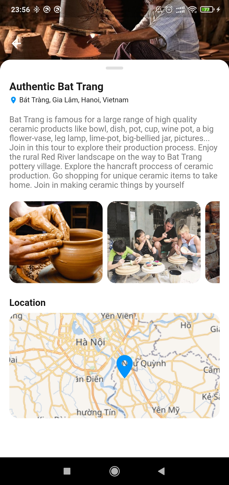
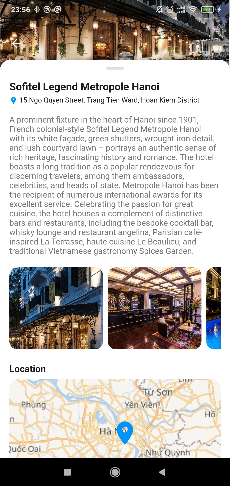
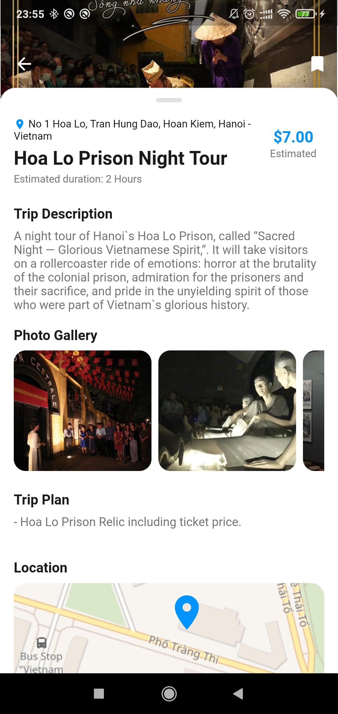
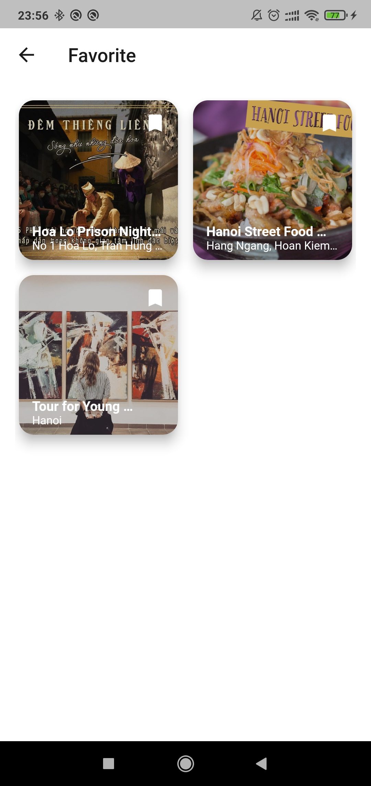

# Mobile and Multimedia System Main Project - City Guide Application

 &nbsp;  &nbsp;  &nbsp;  &nbsp;  &nbsp;  &nbsp;  

**Demo video** 

https://user-images.githubusercontent.com/17596118/169173579-a43dbf84-809f-4456-880f-c65005aa1bf7.mp4

**Application's features:**

**1. Events module**

Show 3 events with below information:
- Name
- Description
- Address
- Location on map
- Photo gallery

**2. Places module**

Show 5 places with below information:
- Name
- Description
- Address
- Voice description
- Ratings
- Photo gallery
- Video
- Location on map
- Reviews from 5 persons

**3. Accommodation module**

Show 3 accommodations with below information:
- Name
- Description
- Address
- Location on map
- Photo gallery

**4. Guide tour module**

Show 5 guide tours with below information:
- Name
- Description
- Estimated time (2 hours, full day, half day)
- Address
- Estimated prices
- Photo gallery
- Trip plan including places to visit
- Location on map

The guided tours could be filtered by categories, including history tour, food tour, or entertaining tour; and filtered by estimated time, including full-day (8 hours), half-day (4 hours), or 2 hours.

Users also can mark their favorite tours, and search tour by name using search bar.

